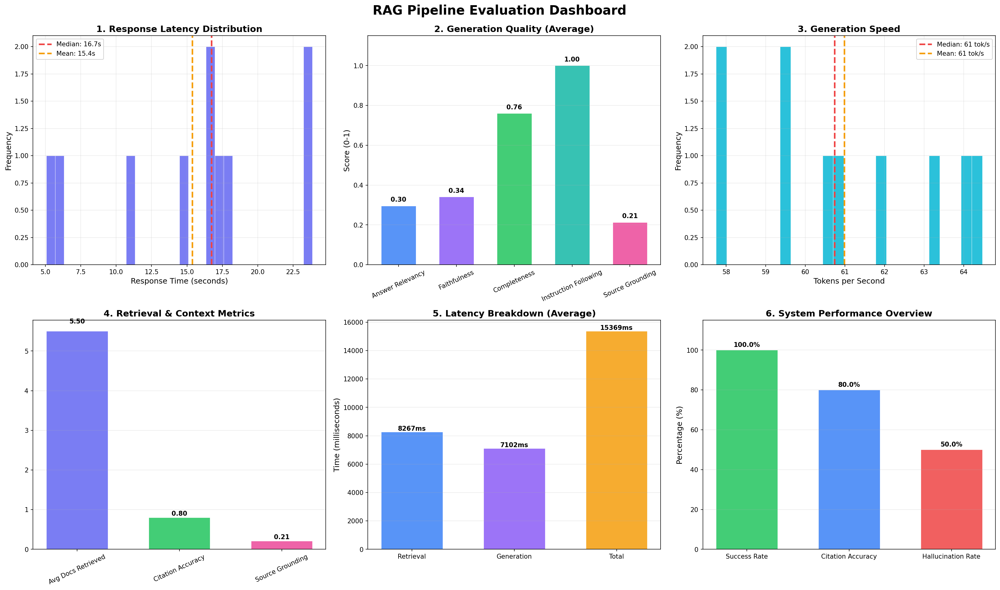

# RAG Pipeline Evaluation Report

**Generated:** 2026-05-19 17:01:27

## Executive Summary

| Metric | Value |
|--------|-------|
| Total Queries | 10 |
| Success Rate | 100.0% |
| Avg Latency | 15369ms |
| P95 Latency | 23863ms |
| Throughput | 0.07 queries/sec |

## Retrieval Metrics

| Metric | Score |
|--------|-------|
| Precision@K | 0.0000 |
| Recall@K | 0.0000 |
| MRR | 0.0000 |
| nDCG | 0.0000 |
| Context Precision | -11.1734 |
| Context Recall | 0.0000 |

## Generation Metrics

| Metric | Score |
|--------|-------|
| Answer Relevancy | 0.2955 |
| Faithfulness Score | 0.3412 |
| Hallucination Rate | 0.5000 |
| Citation Accuracy | 0.8000 |
| Source Grounding | 0.2134 |
| Exact Match | 0.0000 |
| F1 Score | 0.0000 |
| Semantic Similarity | 0.0000 |
| Completeness Score | 0.7600 |
| Instruction Following | 1.0000 |

## Performance Metrics

| Metric | Value |
|--------|-------|
| Avg Retrieval Time | 8267ms |
| Avg Generation Time | 7102ms |
| Avg Total Time | 15369ms |
| P50 Latency | 16836ms |
| P95 Latency | 23863ms |
| P99 Latency | 23863ms |
| Throughput | 0.07 queries/sec |
| Avg Tokens/sec | 61.0 |

## System Metrics

| Metric | Value |
|--------|-------|
| CPU Usage (avg) | 0.0% |
| GPU Usage (avg) | 0.0% |
| Memory Usage (avg) | 0.0% |
| Peak Memory | 0 MB |

## System Information

| Property | Value |
|----------|-------|
| Platform | Windows-11-10.0.26200-SP0 |
| Python Version | 3.13.9 |
| CPU Cores | 12 |
| Total RAM | 15.7 GB |
| GPU Available | False |

## Evaluation Methodology

This evaluation uses a comprehensive multi-dimensional approach:

1. **Retrieval Quality**: Precision@K, Recall@K, MRR, nDCG measure how well the system finds relevant documents.
2. **Generation Quality**: Answer relevancy, faithfulness, completeness, and instruction following assess response quality.
3. **Citation Accuracy**: Verifies that citations reference valid sources and content is grounded.
4. **Hallucination Detection**: Measures rate of unsupported claims and ability to reject out-of-document questions.
5. **Performance**: Latency percentiles, throughput, and system resource utilization.

## Visualizations

